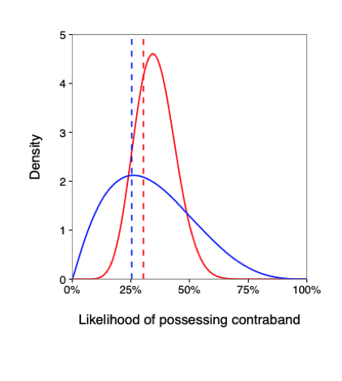
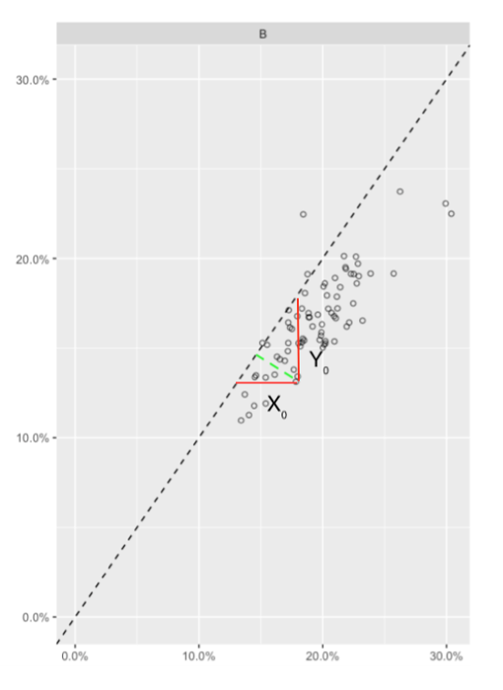
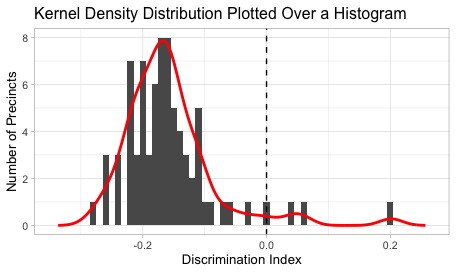
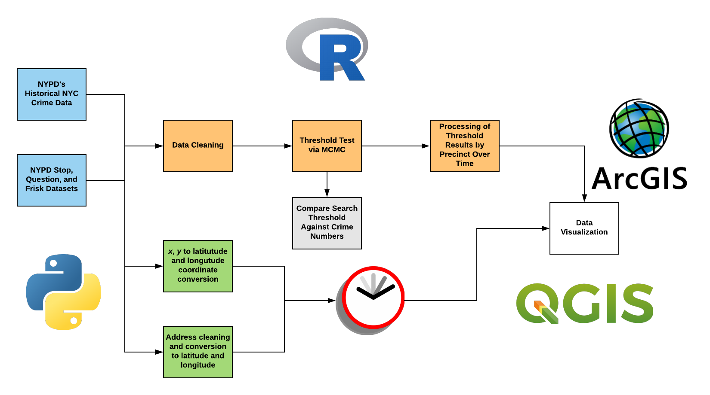
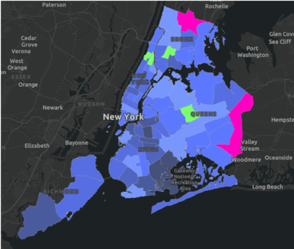

```{r setup, include=FALSE}
library(rstan)
library(dplyr)
library(ggplot2)
library(reshape2)
library(matrixStats)
library(scales)
library(knitr)
library(tikzDevice)
library(grid)
library(gridExtra)
opts_chunk$set(dev = 'pdf')
rstan_options(auto_write = TRUE)
options(mc.cores = parallel::detectCores(), tikzDefaultEngine = 'xetex')
theme_set(theme_light(base_size = 10))
load('sqf_merged.RData')

```

## Introduction

Recent years have caused law enforcement interactions with racial minorities to come under heavy scrutiny by politicians, the press, and the general public. Racially-charged incidents involving police, such as derogatory Facebook posts written by officers in Philadelphia and the fatal shootings of black civilians across the U.S., have sparked controversy over the unfair treatment of minorities by law enforcement. These incidents have caused many to raise concerns about police officers unconsciously adopting racial bias when dealing with minority individuals. While implicit bias, the unconscious attribution of particular qualities of a certain social group, remains embedded in institutions related to law enforcement in the United States, policy makers and chiefs of police have increasingly focused on what is often called implicit bias, inherently unintentional yet more pervasive (GreenWald, 1995; Baker, 2018).  If police officers rely on stereotypes rather than concrete facts, that bias can escalate the situation and have serious, and potentially lethal, consequences. In particular, the New York City Police Department’s (NYPD) Stop, Question, and Frisk (SQF) procedures, in which police officers detain, question, and inspect individuals for contraband under reasonable suspicion, have been accused of racial discrimination.

The United States Supreme Court made an important ruling on stop and frisk practices in the 1968 case Terry v. Ohio. Until 1968, a police officer could search only someone who had been arrested, unless a search warrant had been obtained. However, the ruling granted permission for officers lacking probable cause for an arrest to frisk individuals if the officer has reasonable suspicion they may be dangerous (Katz, 2004). Since this ruling and subsequent court cases on unreasonable searches, the NYPD’s implementation of stop and frisk procedures has caused a major debate around the country. As people became aware of bias within law enforcement, many have questioned the effectiveness of SQF, believing this method of policing targets young black men and increases crime rates. The NYPD’s SQF procedure was found to disproportionately stop blacks and Hispanics; when stopped, these racial groups were less likely than whites to possess a weapon, which implies that police officers apply racially-biased decision-making (Goel et. al., 2016). While New York City has launched police reform initiatives under the leadership of May Bill de Blasio, including diversity training programs for officers, improvements in policing practices in the city remain unknown (Baker, 2018).

Several different factors determine whether a police officer is being discriminatory, including race, behavioral signals, location, time, etc. In response, various bias tests have been created to assess this behavior. The model we utilize in this paper, the threshold test model, best considers the complexity of the New York City area and the SQF procedure. However, previous bias test models have not accounted for spatiotemporal factors, including the fluctuation of racial bias within police precincts over time and the amount of crime in the neighborhoods where stops occur. To better understand racially-discriminative police behavior and propose improved discrimination tests, we employ the threshold test model on NYPD SQF data from 2003 to 2018 for the purposes of determining how criteria for racially-discriminative SQF procedures varies depending on space and time.

## Background

### The Threshold Test
The threshold test model was originally developed in 2017 by researchers at Stanford University. Previous models, including the benchmark and outcome tests, did not consider the full spectrum of factors determining whether an incident was authentically biased.  The benchmark test only compared the search rates of different racial groups, causing the model to have major limitations. For example, consider a region which is mostly populated by black and Hispanic racial groups. There exists a high probability that minorities will be stopped more often than white individuals. This is not necessarily indicative of racially biased policing practices. Addressing this shortcoming of the benchmark test, researchers proposed the outcome test, which is based on the success rate of searches rather than the total search rate. Researchers argued that even if different groups vary in their propensity to carry contraband, discrimination could be detected if searches of minorities yield contraband less often than searches of whites (Simoiu, 2018). However, this test failed to consider the possibility that different racial groups may have different risk distributions of carrying contraband; in this case, discrepancies in the hit rates of different racial groups may reflect this variance in risk distribution rather than indicating racially-biased policing.


```{r, out.width = "100%", echo = FALSE, fig.align = 'center', fig.cap = paste("Thresholds of Two Risk Distributions")}

```

The threshold test, however, combines information on both the search and hit rate and allows us to directly infer the standard of evidence officers require before carrying out a search. The test uses a Bayesian model to determine a race- and precinct-specific search threshold — a specific likelihood of carrying contraband at which an officer decides to search an individual. If an officer determines an individual’s probability of carrying contraband is greater than this threshold, the individual is searched.

To visualize this Figure 1 graphs the hypothetical risk distributions (solid curves) and search thresholds (dashed vertical lines) of two different racial groups (represented by different colors). The search rate for a given group is equal to the area under the risk distribution but above the threshold, and the hit rate is the mean of the distribution conditional on being above the threshold (Simoiu, 2017).

These thresholds characterize the general standard of suspicion that a police officer utilizes to investigate an individual further. Search thresholds that are lower for certain racial groups are indicative of biased policing practices against these groups. Precincts can have varying thresholds for different races, and by comparing them, bias can be detected between racial groups.
 
The threshold test model utilizes Markov Chain Monte Carlo (MCMC) algorithms to take into account prior distributions and create a sample space indicative of thresholds for police departments and precincts. Specifically, for each department and race group, the model compares the observed search and hit rates to their expected values under the sample data-generating process with parameters that are drawn from the inferred posterior distribution. The sampling procedure yields 2,500 ‘warmup’ draws from the joint posterior distribution of the parameters. For each parameter draw, the model analytically computes the resulting search and hit rates and average these over the 2,500 posterior draws (Simoiu, 2018).

### Raw Data
The publicly available NYPD Stop, Question, and Frisk database contained all the records from stops conducted between 2003 through 2018. The records from 2003 through 2016 were in a .csv format and the records from 2017 through 2018 were in a .xlsx format. For the purposes of consistency we converted these latter datasets into a .csv format. The raw datasets include a multitude of columns valuable to our research, such as if an individual in a stop was searched, if contraband was found, if an arrest was made, and the stop’s time and location. The publicly available Historical NYC Crime Data contained the numbers of seven major felony offenses, seven non-major felony offenses, and misdemeanors for each precinct for the years 2000 - 2018.  We extracted data from this record from 2003 through 2018.

## Methods

### Preprocessing of Data and MCMC
The data was first cleaned and filtered using R Studio. The datasets originally presented the details of each police stop, including the race of the suspect, the precinct where the stop was conducted, whether or not the suspect was searched, and whether or not certain types of contraband were found on the individual. From this data, multiple contraband columns were merged to determine whether a search was successful and create a single contraband column. Stops in which the person was not initially searched but had apparent contraband on them were filtered out; in cases like these, the police officer would utilize the visible contraband, not race, as a reason for stopping an individual, and thus, this stop would not indicate . Black Hispanic and white Hispanic individuals were combined to create the single category of Hispanic individuals, while unknown/missing races and Asians, Pacific Islanders, and Native Americans were filtered out. The latter racial groups were not considered because of their smaller demographics, which would cause erroneous statistical analyses. Missing and extraneous data was omitted, and each dataset was converted to find the total stops, total searches, and total hits (successful searches) per race per precinct; in addition, the search rate and hit rate was calculated for each race for each precinct.  

The Historical NYC Crime Data was aggregated via Excel to find the total crime numbers (including major felonies, non-major felonies, and misdemeanors) per precinct for the years 2003 to 2018. Through RStudio, this data was appended to each year’s SQF dataset; the SQF datasets were then aggregated as four four-year chunks, including the years 2003 - 2006, 2007 - 2010, 2011 - 2014, and 2015 - 2018. 

Next, the threshold test model created by Pierson, Corbett-Davies, and Goel (2018), which uses race and precinct as parameters, was applied to the aggregated data using RStan. The Markov Chain Monte Carlo (MCMC) method was used to infer risk distribution parameters and search thresholds for each race per precinct. The search thresholds for white, black, and Hispanic individuals were then plotted externally against crime numbers to determine if a correlation existed. The discrepancies between minority and white search thresholds were then visualized by comparing the two on a bivariate graph. The parameters and search thresholds were used to find the model-predicted search and hit rates, which were then compared to the actual values in posterior predictive checks to determine the robustness of the model. 

```{r threshold_test, fig.height=4, fig.width=8, message=FALSE, warning=FALSE, cache = TRUE}
md_list = list(md1, md2, md3, md4)
stan_data_list = list()

for(i in 1: length(md_list)) {
  stan_data_list[[i]] = with(md_list[[i]], list(
    N = nrow(md_list[[i]]),
    D = length(unique(pct)),
    R = length(unique(race)),
    d = as.integer(pct),
    r = as.integer(race),
    n = numstops,
    s = numsearches,
    h = numhits )) 
}

pctNames1 = unique(md1$pct)
pctNames2 = unique(md4$pct)

model <- stan_model(file = 'threshold_old.stan')
fit = list()
post = list()
for (i in 1: length(stan_data_list))
{
  fit[[i]] = sampling(
    model, data = stan_data_list[[i]], iter=5000,
    init = 'random', chains=5,
    cores=5, refresh=50, warmup = 2500,
    control = list(adapt_delta = 0.95,
                   max_treedepth = 12,
                   adapt_engaged = TRUE))
  
  post[[i]] = rstan::extract(fit[[i]])
}
```

### Calculating and Visualizing Racial Bias Over Time

From the bivariate graph of search thresholds, we determined the signed distance from each point, representing a precinct, to the dashed line, which represents a state of no racial discrimination. These distances represent the amount of racial bias within the precinct; greater distances suggest more racial bias, while distances closer to zero suggest less racial bias. Positive distances denote discrimination against white individuals, and negative distances signify discrimination against black and Hispanic individuals. These distances thus act as a racial discrimination index ($I_D$). The racial discrimination index is calculated as follows:  
\break
$I_d = \sqrt{|x_0 - y_0|} \cdot \mbox{sign}(y_0 - x_0)$  
\break

```{r, out.width = "100%", echo = FALSE, fig.align='center', fig.cap = paste("Calculating the racial discrimination index")}

```
Using $I_D$, we then plotted the overall distribution of the amounts of racial discrimination within each precinct as a kernel density function for each four-year chunk to determine overall potential fluctuations of racial bias. The amount of racial bias against black, white, and Hispanic individuals in each precinct was also visualized over time as a heatmap using ArcGIS to portray trends within each precinct. Above is an example of a kernel density distribution plotted over a histogram. The source code for this process can be found below.
\break
```{r, out.width = "75%", echo = FALSE, fig.align = "center", fig.cap = paste("Kernel Desnity Distribution Plotted Over a Histogram")}

```

```{r dataInfo, fig.height=4, fig.width=8, include = FALSE}
signal_to_p = function(x, phi, delta){
  #Checked. Converts x -> p. 
  #Explain this equation. dnorm is probability density function
  p = phi * dnorm(x, delta, 1) / (phi * dnorm(x, delta, 1) + (1 - phi) * dnorm(x, 0, 1));
  return(p)
}

md_list[[1]]$thresholds = colMeans(signal_to_p(post[[1]]$t_i, post[[1]]$phi, post[[1]]$delta))
md_list[[2]]$thresholds = colMeans(signal_to_p(post[[2]]$t_i, post[[2]]$phi, post[[2]]$delta))
md_list[[3]]$thresholds = colMeans(signal_to_p(post[[3]]$t_i, post[[3]]$phi, post[[3]]$delta))
md_list[[4]]$thresholds = colMeans(signal_to_p(post[[4]]$t_i, post[[4]]$phi, post[[4]]$delta))

precinctGraphs = list()
crimeGraphs = list()
searchGraphs = list()
hitGraphs = list()
plot_department_thresholds = function(obs, post, itr) {
  colors = c('blue', 'black', 'red')
  races = as.character(levels(obs$race))
  mx = max(obs$thresholds)
  df = obs %>% filter(race == 'W') %>%
    right_join(obs %>% filter(race != 'W'), by = 'pct')
  
  allResids <<- sqrt(abs(df$thresholds.x - df$thresholds.y)) * sign((df$thresholds.y - df$thresholds.x))
  
  precinctGraphs[[itr]] <<- ggplot(df) + 
    geom_point(aes(x=thresholds.x, y=thresholds.y, size = numstops.y), alpha=0.8, shape = 1) +
    geom_abline(slope=1, intercept=0, linetype='dashed') +
    scale_y_continuous('Minority threshold\n', limits=c(0,mx), labels=percent, expand=c(0, 0)) +
    scale_x_continuous('\nWhite threshold', limits=c(0,mx), labels=percent, expand=c(0, 0)) +
    scale_size_area(max_size=15) +
    theme(legend.position=c(0.0,1.0),
          legend.justification=c(0,1),
          legend.title = element_blank(),
          legend.background = element_rect(fill = 'transparent'),
          panel.spacing.x=unit(1.5, "cm"),
          plot.title = element_text(hjust = 0.45),
          plot.margin=unit(c(0.2,0.2,0.2,0.2),"cm")) +
    scale_color_manual(values = colors[-1], labels=races[-1]) +
    guides(size=FALSE) + facet_grid(.~race.y) +
    
    if(itr == 1)
      ggtitle("2003 - 2006")
    else if (itr == 2)
      ggtitle("2007 - 2010")
    else if (itr == 3)
      ggtitle("2011 - 2014")
    else if (itr == 4)
    ggtitle("2015 - 2018")
}

plot_crime_thresholds = function(obs, post, itr) {
  mx = max(obs$thresholds)
  cx = max(obs$numcrimes)
  df = obs %>% filter(race == 'W') %>%
    right_join(obs %>% filter(race == 'B'), by = 'pct') %>%
    right_join(obs %>% filter(race == 'H'), by = 'pct')
  
 crimeGraphs[[itr]] <<- ggplot(df) + 
    geom_line(aes(x=numcrimes.x, y=thresholds.x, color = "White"), stat = "identity",
              alpha=0.8) + #white
    geom_line(aes(x=numcrimes.x, y=thresholds.y, color = "Black"), stat = "identity",
              alpha=0.8) + #black
    geom_line(aes(x=numcrimes.x, y=thresholds, color = "Hispanic"), stat = "identity",
              alpha=0.8) + #hispanic
    geom_abline(slope=1, intercept=0, linetype='dashed') +
    scale_y_continuous('Threshold\n', limits=c(0,mx), labels=percent, expand=c(0, 0)) +
    scale_x_continuous('\nCrime Numbers', limits=c(0,cx), expand=c(0, 0)) +
    theme(legend.position=c(0.8, 0.3),
          legend.justification=c(0,1),
          legend.title = element_blank(),
          legend.background = element_rect(fill = 'transparent'),
          panel.spacing.x=unit(1.5, "cm"),
          plot.title = element_text(hjust = 0.45)) + 
    scale_color_manual(values = c("White" = "blue", "Black" = "black", 
                                  "Hispanic" = "red")) +
  if(itr == 1)
      ggtitle("2003 - 2006")
  else if (itr == 2)
    ggtitle("2007 - 2010")
  else if (itr == 3)
    ggtitle("2011 - 2014")
  else if (itr == 4)
    ggtitle("2015 - 2018")
}

search_rate_ppc <- function(obs, post, itr, ylim = 0.03) {
  obs$pred_search_rate = colMeans(post$searchrate)
  searchGraphs[[itr]] <<- ggplot(data=obs, aes(x=pred_search_rate, y=pred_search_rate-searchrate)) +
    geom_point(aes(size=numstops, color=race), alpha = 0.8) + 
    scale_size_area(max_size=10) +
    scale_x_continuous('\nPredicted search rate', labels=percent)+
    scale_y_continuous('Search rate prediction error\n', labels=percent, limits=c(-ylim, ylim)) +
    geom_abline(slope=0, intercept=0, linetype='dashed') +
    theme(legend.position=c(1.0,0),
          legend.justification=c(1,0),
          legend.title = element_blank(),
          legend.background = element_rect(fill = 'transparent'),
          plot.title = element_text(hjust = 0.45)) +
    scale_color_manual(values=c('blue','black','red', 'green4')) +
    guides(size=FALSE) +
    
  if(itr == 1)
      ggtitle("2003 - 2006")
  else if (itr == 2)
    ggtitle("2007 - 2010")
  else if (itr == 3)
    ggtitle("2011 - 2014")
  else if (itr == 4)
    ggtitle("2015 - 2018")
}

hit_rate_ppc <- function(obs, post, itr, ylim = 0.3) {
  obs$pred_hit_rate = colMeans(post$hitrate)
  hitGraphs[[itr]] <<- ggplot(data=obs, aes(x=pred_hit_rate, y=hitrate-pred_hit_rate)) +
    geom_point(aes(size=numstops, color=race), alpha=0.8) + 
    scale_size_area(max_size=10) +
    scale_x_continuous('\nPredicted hit rate', labels=percent) +
    scale_y_continuous('Hit rate prediction error\n', labels=percent, limits = c(-ylim, ylim)) +
    geom_abline(slope=0, intercept=0, linetype='dashed') +
    theme(legend.position=c(1.0,0),
          legend.justification=c(1,0), 
          legend.title = element_blank(),
          legend.background = element_rect(fill = 'transparent'),
          plot.title = element_text(hjust = 0.45))+
    scale_color_manual(values=c('blue','black','red', 'green4')) +
    guides(size=FALSE) +
    
  if(itr == 1)
      ggtitle("2003 - 2006")
  else if (itr == 2)
    ggtitle("2007 - 2010")
  else if (itr == 3)
    ggtitle("2011 - 2014")
  else if (itr == 4)
    ggtitle("2015 - 2018")
}

disc_indx_list = list()

for (i in 1: length(md_list)){
  print(plot_department_thresholds(md_list[[i]], post[[i]], i))
  
  distVals = split(allResids, 1:2)
  # Black Distance
  dist_B = unlist(distVals[1])
  #plots thresholds across crime numbers
  
  # Hispanic Distance
  dist_H = unlist(distVals[2])
  
  if (i == 1 | i == 2) {
    disc_indx_list[[i]] = data.frame(pct = pctNames1, black_disc_index = dist_B,
                                     hispanic_disc_index = dist_H)
  }

  else {
    disc_indx_list[[i]] = data.frame(pct = pctNames2, black_disc_index = dist_B,
                                     hispanic_disc_index = dist_H)
  }
  
  print(plot_crime_thresholds(md_list[[i]], post[[i]], i))
  print(search_rate_ppc(md_list[[i]], post[[i]], i))
  print(hit_rate_ppc(md_list[[i]], post[[i]], i))
}
``` 

\newpage
### Geocoding and Map Visualizations

The original NYPD SQF dataset was filtered using the same method as previously described; however, the data was left in its original form describing individual stops, rather than aggregating total stops, searches, and hits. The datasets from 2006 - 2018 included a column with x- and y-coordinates from the NAD83 / New York Long Island (ftUS) state plane coordinate system. The script converts these coordinates to latitude and longitude using ArcGIS’s geocoding APIs values which can be plotted with a geographic information systems (GIS) software. The datasets from 2003 - 2005 did not include the state plane coordinates. Another python script was written that merged together columns with address information about stops including street numbers, street names, and intersection names. This combined information was fed into the ArcGIS geocoding APIs to generate latitude and longitude coordinates. This process took approximately one week to complete due to the process intensive nature of geocoding addresses. We utilized a high-performance computing cluster to ensure a sturdy network and adequate memory for the task. Through QGIS, each year’s stops was visualized as a density heatmap. The heatmaps for all years were then animated as a GIF using ezgif.com. We also utilized ArCGIS to create two map visualizes indicating how racial bias against black and Hispanic individuals has changed over time in the city.

```{r, out.width = "100%", echo = FALSE, fig.align = "center", fig.cap = paste("Methodology flowchart for processing SQF datasets")}

```

\newpage
## Results
### Comparing Minority and White Thresholds
To visualize discriminatory policing practices against black and Hispanic racial groups, minority versus white search thresholds of the various New York City Police precincts are plotted below. The dotted line represents policing practices where no discrimination occuried. Several precincts fall quite close to this line, so it is possible that the regions of these precincts are populated with a particular racial group. The size of the circles represent the number of stops of minorities in each precinct. In the 2015 - 2018 chunk a significant portion of the data is heavily condensed over a higher threshold rate and also closer to the dotted linear regression line.

``` {r graphPrecinct, fig.height=10, fig.width=12, echo=FALSE}
graphTitle = textGrob("NYPD Precinct Minority v. White Thresholds", gp=gpar(fontsize = 18, fontface="bold"))
grid.arrange(precinctGraphs[[1]], precinctGraphs[[2]],
             precinctGraphs[[3]], precinctGraphs[[4]], ncol = 2, nrow = 2,
             top = graphTitle)
```

### Search Threshold vs. Crime Number Analysis
The following graphs plots the search threshold changes among white, black, and Hispanic racial groups against the number of total number of crimes in New York City, over four four-year periods from 2003 through 2018. For each of the four-year chunks there is a consistent decrease in thresholds for all racial groups when they are under ten thousand crimes. In the three four-year chunks from 2003 - 2014, the white threshold is almost always consistently higher than the black and Hispanic thresholds regardless of the number of crimes. In the 2015 - 2018 chunk, the thresholds across races are relatively close together as the number of crimes increases. In all chunks, the thresholds for each race consistently vary according to the same pattern, particularly between ten-thousand and forty-thousand crimes. The search thresholds generally increase after sixty-thousand crimes for the three four-year chunks from 2003 - 2014 and after fifty-thousand crimes for the chunk from 2015 -2018.

``` {r graphCrimes, fig.height=10, fig.width=12, echo=FALSE}
graphTitle = textGrob("Thresholds v. Crime Numbers Across Races", gp=gpar(fontsize = 18, fontface="bold"))
grid.arrange(crimeGraphs[[1]], crimeGraphs[[2]],
             crimeGraphs[[3]], crimeGraphs[[4]], ncol = 2, nrow = 2,
             top = graphTitle)
```

### Average Thresholds and Credibility Intervals

The following table summarizes how the search threshold has changed over four four-year periods from 2003 through 2018. Under all circumstances the threshold for white individuals is higher than that for both black and Hispanic minorities. The average search threshold in the period from 2011 through 2014 is of particular interest. Historically this was at the height of SQF practices by the NYPD and black and Hispanic racial groups are searched at significantly lower search thresholds than their white counterparts. For the three four-year periods from 2003-2011, the 95% credibility interval is typically no larger than a range of 0.3. However, in the last four-year period from 2015 to 2018 this range for the 95% credibility more than doubles. This may be the result of a lack of data points for this last four-year set, an issue discussed in Posterior Predictive Checks. 

```{r avgTables, fig.height=10, fig.width=12, echo=FALSE, message=FALSE}
avg_thresh_df = list()
for(i in 1: length(md_list)) {
  mdmod = md_list[[i]] %>% 
    mutate(thresholds = colMeans(signal_to_p(post[[i]]$t_i, post[[i]]$phi, post[[i]]$delta))) %>%
    group_by(pct) %>%
    mutate(total_stops = sum(numstops)) %>%
    ungroup()
  
  na_replace = function(x, r) ifelse(is.finite(x), x, r)
  
  accumrowMeans = function(M, i, w = rep(1, nrow(M)), imax = max(i)) {
    t(sapply(1:imax, function(j) (i == j)*na_replace(w/sum(w[i == j]),0))) %*% M
  }
  
  avg_thresh = accumrowMeans(t(signal_to_p(post[[i]]$t_i, post[[i]]$phi, post[[i]]$delta)),
                             as.integer(mdmod$race), mdmod$total_stops)
  
  avg_thresh_df[[i]] <- data.frame(levels(mdmod$race),
             sprintf('%.3f', rowMeans(avg_thresh)),
             apply(rowQuantiles(avg_thresh, probs = c(0.025, 0.975)), 1,
                   function(x) paste0('(', paste0(sprintf('%.3f',x), collapse = ', '), ')'))
  ) %>%
    setNames(c('Driver Race', 'Average Threshold', '95% Credible Interval'))
}
```
\newpage
#### 2003 - 2006
```{r , echo=FALSE, warning = FALSE, message = FALSE}
avg_thresh_df[[1]]
```

#### 2007 - 2010
```{r , echo=FALSE, warning = FALSE, message = FALSE}
avg_thresh_df[[2]]
```

#### 2011 - 2014
```{r , echo=FALSE, warning = FALSE, message = FALSE}
avg_thresh_df[[3]]
```

#### 2015 - 2018
```{r , echo=FALSE, warning = FALSE, message = FALSE}
avg_thresh_df[[4]]
```

### Posterior Predictive Checks

The following graphs present the posterior predictive checks for each of the four-year chunks. For each chunk, the error in the model-predicted search and hit rates per race per precinct were graphed. For the years 2003 - 2014, the search rate error remains relatively small across races and precincts. For the same years, the hit rate error is generally higher with more variance, although it still provides reasonable accuracy for the majority of races and precincts. However, the chunk for years 2015 - 2018 presents large errors in both the model-predicted search and hit rates. This is likely due to the fact that these years had considerably less data than previous years due to a reduction in SQF stops during this time period; after the 2013 court case Floyd v. City of New York debating the constitutionality of the SQF procedure, SQF stops dramatically decreased. These smaller numbers would cause erroneous results when running the threshold test model, which was designed for large-scale statistical analysis. Therefore, the 2015 - 2018 results are inconclusive and may be better studied with a different type of statistical method.

``` {r graphSearch, fig.height=6, fig.width=9, echo=FALSE, warning = FALSE, message = FALSE}
graphTitle = textGrob("Search Rate Posterior Predictive Checks", gp=gpar(fontsize = 18, fontface="bold"))
grid.arrange(searchGraphs[[1]], searchGraphs[[2]],
             searchGraphs[[3]], searchGraphs[[4]], ncol = 2, nrow = 2,
             top = graphTitle)
```
``` {r graphHit, fig.height=6, fig.width=9, echo=FALSE, warning = FALSE, message = FALSE}
graphTitle = textGrob("Hit Rate Posterior Predictive Checks", gp=gpar(fontsize = 18, fontface="bold"))
grid.arrange(hitGraphs[[1]], hitGraphs[[2]],
             hitGraphs[[3]], hitGraphs[[4]], ncol = 2, nrow = 2,
             top = graphTitle)
```

### Racial Bias Over Time

To visualize fluctuations in racial bias over time, the distribution of racial bias in precincts was plotted for each-four year chunk. Positive discrimination indices indicate bias against white individuals, while negative discrimination indices indicate bias against minorities. In the period from 2003 chunk, black individuals begin with both a higher racial bias index and a greater number of discriminative precincts than those associated with Hispanic individuals, and both minorities are higher in both categories when compared to white individuals. For both black and Hispanic individuals, there is a decrease in both the discrimination index and the number of discriminative precincts over time. This was paired with a simultaneous increase in the number of precincts discriminative toward white individuals, although the discrimination index for white individuals stayed within the same relative range across all the chunks. It is significant to note that racial bias and the number of discriminative precincts for black individuals decreased considerably less than bias against Hispanic individuals. In both graphs, the increase in racial discrimination against whites occurred in a relatively small number of precincts with a relatively small discrimination index in comparison to both black and Hispanic individuals. This implies that racial bias against black individuals has remained more prevalent and more considerable than racial bias against Hispanic individuals measured across time, although both minorities continue to face far greater and far more prevalent discrimination than white individuals across all chunks. The general decreasing trend in racial bias signifies that policing practices are becoming less discriminative.

```{r graphBias, fig.height=6, fig.width=10, echo=FALSE, warning=FALSE}
disc_indx_list[[1]] = rbind(disc_indx_list[[1]], data.frame(pct = as.factor(121), black_disc_index = 0, hispanic_disc_index = 0))
disc_indx_list[[2]] = rbind(disc_indx_list[[2]], data.frame(pct = as.factor(121), black_disc_index = 0, hispanic_disc_index = 0))

discIndxdf = data.frame(pct = disc_indx_list[[1]]$pct, 
                        B1 = disc_indx_list[[1]]$black_disc_index, 
                        H1 = disc_indx_list[[1]]$hispanic_disc_index, 
                        B2 = disc_indx_list[[2]]$black_disc_index, 
                        H2 = disc_indx_list[[2]]$hispanic_disc_index, 
                        B3 = disc_indx_list[[3]]$black_disc_index, 
                        H3 = disc_indx_list[[3]]$hispanic_disc_index, 
                        B4 = disc_indx_list[[4]]$black_disc_index, 
                        H4 = disc_indx_list[[4]]$hispanic_disc_index)

yearIntervals = c("2003-2006", "2007-2010", "2011-2014", "2015-2018")

d1 = density(discIndxdf$B1)
d2 = density(discIndxdf$B2)
d3 = density(discIndxdf$B3)
d4 = density(discIndxdf$B4)
d5 = density(discIndxdf$H1)
d6 = density(discIndxdf$H2)
d7 = density(discIndxdf$H3)
d8 = density(discIndxdf$H4)
kd1 <- data.frame(Time_Frame = "2003 - 2006", x = d1$x, y = d1$y)
kd2 <- data.frame(Time_Frame = "2007 - 2010", x = d2$x, y = d2$y)
kd3 <- data.frame(Time_Frame = "2011 - 2014", x = d3$x, y = d3$y)
kd4 <- data.frame(Time_Frame = "2015 - 2018", x = d4$x, y = d4$y)
kd5 <- data.frame(Time_Frame = "2003 - 2006", x = d5$x, y = d5$y)
kd6 <- data.frame(Time_Frame = "2007 - 2010", x = d6$x, y = d6$y)
kd7 <- data.frame(Time_Frame = "2011 - 2014", x = d7$x, y = d7$y)
kd8 <- data.frame(Time_Frame = "2015 - 2018", x = d8$x, y = d8$y)

merged_kd1 = Reduce(function(x, y) merge(x, y, all=TRUE), list(kd1, kd2, kd3, kd4))
merged_kd2 = Reduce(function(x, y) merge(x, y, all=TRUE), list(kd5, kd6, kd7, kd8))

p1 = ggplot() +
  geom_line(data = merged_kd1, aes(x, y, color = Time_Frame), size = 1) +
  geom_vline(xintercept = -0.05, linetype = "dashed", color = "green4") +
  geom_vline(xintercept = 0, linetype = "dashed") +
  geom_vline(xintercept = 0.05, linetype = "dashed", color = "green4") +
  scale_size_area(max_size = 5) +
  scale_color_manual(values = c("#b3ccff", "#6699ff", "#3377ff", "#004de6")) +
  theme(legend.position = "bottom", legend.title = element_blank())

p1 = p1 + labs(title = "Black", x = "Discrimination Index", y = "Number of Precincts")

p2 = ggplot() +
  geom_line(data = merged_kd2, aes(x, y, color = Time_Frame), size = 1) +
  geom_vline(xintercept = -0.05, linetype = "dashed", color = "green4") +
  geom_vline(xintercept = 0, linetype = "dashed") +
  geom_vline(xintercept = 0.05, linetype = "dashed", color = "green4") +
  scale_size_area(max_size = 5) +
  scale_color_manual(values = c("#ff9999", "#ff4d4d", "#ff0000", "#b30000")) +
  theme(legend.position = "bottom", legend.title = element_blank())

p2 = p2 + labs(title = "Hispanic", x = "Discrimination Index", y = "Number of Precincts")

graphTitle = textGrob("Racial Bias Over Time", gp=gpar(fontsize = 18, fontface="bold"))
grid.arrange(p1, p2, ncol = 2, top = graphTitle)
```

### Map Visualization
The density heatmap of the SQF stops across all years can be seen via this link: https://media.giphy.com/media/XaFRbg4JgbXKxaP00M/giphy.gif. Visualizations like this one grant the ability to determine “hot spots” of NYPD SQF activity throughout the years, which can then be investigated for further analysis. 

The ArcGIS heatmap displaying the Hispanic discrimination index for each precinct across the four-year chunks can be accessed with this link:
https://njit-r.maps.arcgis.com/apps/TimeAware/index.html?appid=326a003595324aae8fde6f55e4ce8c59

The heatmap displaying the black discrimination index can be accessed with this link:
https://njit-r.maps.arcgis.com/apps/TimeAware/index.html?appid=ef6d665772ce49dcb8a55a839c830ff9

Green precincts represent precincts in which the discrimination index for either white or minority groups was less than an absolute value of 0.05; these precincts have little discrimination that may be due to chance rather than implicit racial bias. We consider precincts outside of this range to have discriminatory policing embedded in their SQF practices. Pink precincts represent precincts discriminating against white individuals, while blue and purple precincts discriminating against hispanic and black people, respectively. An example of the Hispanic discrimination index heatmap for a single four-year chunk is shown below. 


```{r, out.width = "100%", echo = FALSE, fig.align = "center", fig.cap = paste("Black Discrimination Index Heatmap")}

```


The ArcGIS heatmaps easily show where racial bias exists within New York City over a 16 year period, allowing policymakers and police chiefs to determine the progression of equality within their precincts and in relation to surrounding precincts to make future policing decisions that work best for their individual communities. 

## Conclusion

While there was no significant correlation between the search thresholds and neighborhood crime numbers, white search thresholds were consistently higher than black and Hispanic search thresholds, implying consistent racial discrimination against these minorities. However, all thresholds presented near identical patterns of variance across the different crime numbers of separate precincts, implying that different precincts were mostly consistent with how they treated different racial groups.

The model was generally accurate at predicting the search rate of all races but slightly increased in error when predicting the hit rate for the years 2003 - 2014; the large errors in search and hit rates for the years 2015 - 2018 indicate these results are inconclusive due to an insufficiency of data points. This suggests that statistical methods meant for smaller-scale analysis might be better suited to analyzing these years and future years; future studies may consider revising the threshold test model to work with smaller datasets.

Overall, racially discriminative policing against black and Hispanic individuals have slowly decreased across the years 2003 - 2018 in both the prevalence and the extent of discrimination; however, there remains significant work to be done towards eradicating racial bias within the NYPD’s SQF procedure. 

This information, along with a robust visualization platform for racial bias, provides valuable tools for policymakers, police, and residents to make informed decisions about policing practices in the places that they call home.

## Future Work
This research examines the use of the threshold test model within the context of racially-biased policing practices; however, the model has the potential to be applied to a variety of fields, such as banking, college admissions, healthcare, and hiring practices. The model can also be presented in different web application and visualization formats that allow ease of access to both civilians and law enforcement.

Aside from applying the threshold test to different settings, the model itself can be revised to reflect different parameters, such as neighborhood crime or population density, precinct racial demographics, and the time the stop occurred. Additional parameters may increase the accuracy of the model and the credibility of the results. In pursuit of increased accuracy, future studies may also focus on revising the model to create a dual-threshold test, which calculates separate search thresholds for innocent and guilty individuals.

In addition, this research can delve deeper into spatial analysis by adopting spatial weights, which may better present the relationships between biased precincts and neighborhoods. Spatial weights would not only consider stop factors within a single precinct but also consider how the bias in a single precinct would influence its neighbors and vice versa. This type of spatial analysis has the potential to not only help law enforcement but also help urban planners see how bias affects daily life in neighborhoods.

Lastly, we hope this research inspires the creation of objective tools for law enforcement officers and policymakers to determine the quality of local policing practices in all areas of the United States.

\newpage
## References

Al Baker. “Confronting Implicit Bias in the New York Police Department.” The New York Times, 2018.

Ian Ayres. “Outcome tests of racial disparities in police practices.” Justice Research and Policy, 2002.

A.G. Greenwald, M.R. Banaji. "Implicit social cognition: Attitudes, self-esteem, and stereotypes". Psychological Review, 1995.
Lewis R. Katz. "Terry v. Ohio at Thirty-Five: A Revisionist View." Mississippi Law Journal, 2004. 

Emma Pierson, Sam Corbett-Davies, and Sharad Goel. “Fast threshold tests for detecting discrimination.” Forthcoming, 2018.

Camelia Simoiu, Sam Corbett-Davies, and Sharad Goel. “The problem of infra-marginality in outcome tests for discrimination.” Annals of Applied Statistics, 2017.

Camelia Simoiu, et al. “The threshold test: Testing for racial bias in vehicle searches by police.” StanCon, 2018.

## Acknowledgements
* New Jersey Institute of Technology

* The National Science Foundation

* Directors of the Computational Data Analytics for Advancing Human Services REU
  + Dr. Zhi Wei
  + Dr. Lian Duan
